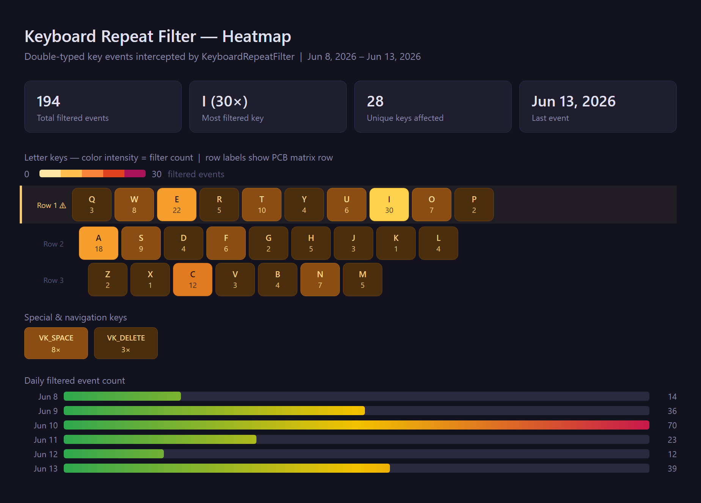

# G915-Stutter-Fix

**A tiny, user-mode keyboard filter that makes a stuttering keyboard feel brand new again.**

Some Logitech G915/G915X units (and other keyboards with the same defect) emit *impossible* HID
sequences, phantom key repeats and double-presses that arrive faster than any human could ever
type. The result is maddening: `thiss becomess thiis`, a held `Ctrl` that randomly lets go
mid-shortcut, a game character that won't keep walking. `G915-Stutter-Fix` sits quietly in your
system tray, watches the keyboard at the lowest user-mode level Windows allows, and silently drops
those invalid events *before* they ever reach your applications.

No drivers. No firmware flashing. No registry surgery. No network access. Close the app and your
system is exactly as it was. User reports confirm it eliminates the stutter/double-keypress problem
on affected G915/G915X units, and it's small enough to read end-to-end in a coffee break.

> **Version 3.0.2**, Windows 10/11 x64 · .NET Framework 4.8 · MIT licensed · 100% offline

---

## Tools

| Tool | Description |
|---|---|
| `KeyboardRepeatFilter.exe` | Runs in the system tray and silently filters stutter/duplicate keypresses (and, optionally, chattering mouse clicks) in real time. |
| `KeyboardHeatmap.exe` | Companion CLI that reads the filter log and generates a self-contained HTML heatmap of filtered key counts, great for *seeing* which keys misbehave. |

---

## What's new in 3.0.2

- **Fixed key handling broken by 3.0.1 in *Protect held keys* mode.** The 3.0.1 release sent the
  re-emitted key-up by scan code alone, which made Windows re-derive the key from the scan code plus
  NumLock, layout, and the extended-key flag. That guess did not always match the original key, so
  keys stuck down at the system level: **Alt+Tab reversed**, **Escape** acted like a window switch,
  and the **numpad** stopped working (worst on AZERTY). The release is now sent by the original
  virtual key again, while still carrying the captured hardware scan code, so the system releases the
  exact key that was pressed **and** games reading by scan code (DirectInput/Raw Input, **World of
  Warcraft** included) still see a clean release.

See [`CHANGELOG.md`](CHANGELOG.md) for the complete list.

---

## What's new in 3.0.1

- **Held game keys fixed in *Protect held keys* mode.** This mode re-emits a withheld key-up
  itself, but it sent the release by virtual key with no scan code. Games that read the keyboard by
  hardware scan code (DirectInput/Raw Input, **World of Warcraft** included) never saw a clean
  release, so a key like **Space** (jump) or **Z** on an AZERTY layout would desync and stop working.
  The synthetic release is now sent by scan code, captured from the real key-down and keeping the
  extended-key flag, so games treat it exactly like a physical key-up.
- **Bundled `WoW.json` profile.** A ready-made World of Warcraft profile that works on both **AZERTY
  and QWERTY** layouts: *Protect held keys* mode with a tight 12 ms release on the movement keys
  (**Z/Q** and **W/A** plus shared **S/D**), **Space**, left **Shift**, and right **Ctrl**. Switch to
  it live from **Tray → Profile → WoW**.

See [`CHANGELOG.md`](CHANGELOG.md) for the complete list.

---

## What's new in 3.0.0

- **Mouse-button debouncing.** A chattering mouse switch turns one physical click into a phantom
  double-click; the same low-level technique that fixes the keyboard now fixes the mouse. An
  optional `WH_MOUSE_LL` hook drops a button press that arrives within a threshold of that button's
  previous release, covering the left, right, middle, and both side (X1/X2) buttons.
- **Off by default, one click to enable.** Keyboard-only users are unaffected. Turn it on from the
  new **Enable mouse click debounce** tray item (persisted to `config.json`), tune the window with
  `MouseMinRepeatIntervalMs` (default **50 ms**, below an intentional double-click), and exclude
  specific buttons with `ExcludedMouseButtons`.
- **Profiles, with a ready-made Gaming profile.** Keep multiple configs side by side and switch live
  from **Tray → Profile** (the startup `config.json` is marked **(default)**). A bundled
  **`gaming.json`** ships tuned for movement: *Protect held keys* mode so a chattering key can't drop
  your held W/A/S/D, with a tight 12 ms release on **W/A/S/D and crouch (right Ctrl)** while action
  keys stay protected.
- **Sticky "Run as administrator."** A new **Always run as administrator** tray toggle (`RunAsAdmin`)
  relaunches elevated on every launch, so the hook can filter elevated windows without re-choosing it
  each time.
- **A richer heatmap.** The report now draws the **modifier row** (Ctrl/Win/Alt/Space/Fn/Menu) and
  both **Shift** keys, adds a stylized **mouse graphic** with per-button counts, and a new
  `HeatmapDays` setting limits it to the last *N* days.
- **Sticky Keys fix.** A chattering **Shift** no longer leaves unbalanced key-ups that spuriously
  triggered the Windows Sticky Keys prompt (a problem that showed up especially over high-latency
  RDP).

See [`CHANGELOG.md`](CHANGELOG.md) for the complete list.

---

## What's new in 2.1.0

- **Restart as administrator.** A new tray menu item (shown only while running unelevated)
  relaunches the app with administrator rights via a UAC prompt, so the keyboard hook can also
  filter input for **elevated windows** instead of being bypassed for them (UIPI). The
  elevated-window notice is now clickable and triggers the same relaunch.
- **A more readable elevated-window notice.** The popup stays up longer and pauses its
  auto-dismiss countdown while the pointer is over it, so you can actually read and click it.
- **A smoother admin handoff.** The single-instance guard now waits briefly for the mutex instead
  of exiting immediately, so the restart-as-admin handoff no longer trips the singleton and kills
  the new elevated instance.

See [`CHANGELOG.md`](CHANGELOG.md) for the complete list.

---

## What's new in 2.0.0

Version 2.0 is a substantial upgrade over the 1.x line. Highlights:

- **Two filter modes, switchable from the tray.** The classic mode stops duplicate characters;
  the new **Protect held keys** mode keeps `Ctrl`/`Shift` and game movement keys logically held
  through a bounce, so shortcuts and sprint keys stop breaking.
- **Human-readable config.** Exclude keys and set per-key thresholds by **name** (`Back`,
  `Return`, `I`, `Ctrl`) instead of cryptic virtual-key numbers. Typing `Ctrl` covers *both* the
  left and right keys automatically.
- **A genuinely useful heatmap.** A warm "ember" color ramp, a dynamic green→yellow→crimson
  daily-activity chart, an automatic "busiest row" flag, and a banner that warns you about typos
  in your config.
- **It tells you when it can't help.** When you focus a window running **as administrator**,
  Windows forbids a normal-user filter from touching its input. Instead of looking broken, the
  app turns its tray icon yellow, shows a brief (non-focus-stealing) notice, and logs it, then
  silently recovers when you switch back.
- **Everything important is one click away.** Filter mode, the notice popup, and autostart are all
  toggles in the tray menu, and every choice persists to `config.json`.

See [`CHANGELOG.md`](CHANGELOG.md) for the complete list.

---

## Features in detail

### Real-time stutter filtering
A low-level keyboard hook (`WH_KEYBOARD_LL`) inspects every key event and discards repeats that
arrive faster than a configurable threshold (default **28 ms**, below the biomechanical limit of a
real double-tap). Filtering is per-key configurable and certain keys (Backspace, Enter, volume) are
excluded by default so legitimate fast input is never touched.

### Two filter modes
- **Block double presses** (`BlockRepress`, default), blocks the spurious *re-press*, so one tap
  produces one character. Ideal for normal typing.
- **Protect held keys** (`BlockRelease`), withholds the spurious *release*, so a held modifier or
  movement key stays down through a bounce. Ideal for `Ctrl`/`Shift` shortcuts and gaming, at the
  cost of a few milliseconds of release latency.

Switch between them live from **Tray → Filter mode**; the choice is saved and applied immediately.

### Mouse-button debouncing
A worn or chattering mouse switch turns a single physical click into a phantom double-click. The
same idea that fixes the keyboard fixes the mouse: an optional low-level mouse hook
(`WH_MOUSE_LL`) drops a button press that arrives within a threshold of that button's previous
release, so one click stays one click. It covers the left, right, middle, and both side (X1/X2)
buttons, and is **off by default** so keyboard-only users are unaffected. Turn it on from
**Tray → Enable mouse click debounce** (saved to `config.json`), tune the window with
`MouseMinRepeatIntervalMs`, and exclude specific buttons with `ExcludedMouseButtons`. The default
**50 ms** window sits well below an intentional double-click, so real double-clicks are preserved.

> **Note:** the debounce is **generic, not mouse-specific.** It works at the Windows input layer on
> any standard pointing device's button events, regardless of make, model, or driver. It is not tied
> to a particular mouse, and there is nothing to configure per device.

### Profiles (with a ready-made Gaming profile)
Keep more than one configuration side by side. Drop any number of config `.json` files next to the
app and switch between them live from **Tray → Profile**. Every file that looks like a config (it
shares our setting names) appears as a selectable profile; the startup `config.json` is marked
**(default)**. Selecting one loads it as the live configuration and applies it instantly, great for
keeping, say, a precise everyday-typing setup and an aggressive gaming setup a click apart.

A **`gaming.json`** profile ships in the box, tuned for movement:

- **Protect held keys** (`BlockRelease`) mode so a chattering key can't drop your held **W/A/S/D**
  mid-run.
- Tight **12 ms** per-key release on **W/A/S/D and crouch (right Ctrl)** so stops stay razor-sharp,
  while tapped action keys keep the full protective threshold.
- Elevated-window pop-ups off; mouse debouncing left off so it can't swallow rapid clicks.

Activate it from **Tray → Profile → gaming**.

> **Reality check:** see [Gaming and anti-cheat](docs/USAGE.md#gaming-and-anti-cheat) for what a
> filter can and cannot do in games, kernel-level anti-cheat and Raw Input can keep keystrokes away
> from any user-mode hook, and no profile changes that.

### Friendly, forgiving configuration
`ExcludedKeys` and per-key thresholds accept key **names** exactly as they appear in the log, the
`VK_` prefix is optional and matching is case-insensitive. Generic modifiers (`Ctrl`, `Shift`,
`Alt`) expand to both the left and right keys. Raw numeric virtual-key codes still work as an escape
hatch, and unrecognized names are reported in the log rather than failing silently.

### Elevated-window awareness
Windows security (UIPI) prevents a normal-user hook from filtering input to **administrator**
windows. The app detects this state, turns the tray icon **yellow** with a plain-language tooltip,
shows a brief focus-safe corner notice (toggleable), and records it in the log, recovering
automatically when a normal window regains focus.

### Diagnostic heatmap
`KeyboardHeatmap.exe` turns your filter log into a beautiful, self-contained HTML report so you can
see exactly which keys (and which days) are the worst offenders.

---

## Heatmap



A diagnostic visualization showing which keys generate filtered/duplicate events, rendered with a
warm ember intensity ramp (light and dark themes), a "busiest row" flag, summary stat cards, an
optional daily-activity chart, and a banner that surfaces any configuration warnings found in the
log.

| Argument | Default | Description |
|---|---|---|
| `logFile` | `KeyboardRepeatFilter.log` in the current dir (or `LogFilePath` from `config.json`) | Path to the filter log file. |
| `outputFile` | `KeyboardHeatmap.html` next to the log file | Path for the generated HTML report. |
| `-v` / `--v` | off | Include the **Daily filtered event count** section in the output. |

**Examples:**

```bash
# Generate a heatmap from the default log file
KeyboardHeatmap.exe

# Generate a heatmap from a specific log file
KeyboardHeatmap.exe "C:\temp\KeyboardRepeatFilter.log"

# Generate a heatmap including the daily filtered-event chart
KeyboardHeatmap.exe -v
```

The report is a single `.html` file with no external dependencies, open it in any browser. On
success, `KeyboardHeatmap.exe` opens it for you automatically.

---

## Quick Start

### KeyboardRepeatFilter

1. Build the solution in `Release` mode (or download a release).
2. Open the `releases` folder after the build completes.
3. Ensure it contains `KeyboardRepeatFilter.exe`, `KeyboardHeatmap.exe`, `Newtonsoft.Json.dll`,
   `config.json`, and the bundled `gaming.json` profile.
4. Copy those files to a writable folder of your choice (for example `C:\Utils\KeyboardRepeatFilter`).
5. Run `KeyboardRepeatFilter.exe`.
6. Confirm the tray icon appears and type normally, the stutter should be gone.

Right-click the tray icon to switch **Profile**, switch **Filter mode**, toggle **mouse-button
debouncing**, toggle the notice popup, enable **Autostart**, or launch the heatmap.

#### "Unknown publisher" is normal

The first time you run `KeyboardRepeatFilter.exe`, Windows may show one or both of these prompts:

- **User Account Control** ("Do you want to allow this app to make changes?") listing
  **Publisher: Unknown**, with a yellow banner.
- **SmartScreen** ("Windows protected your PC") with a **Run anyway** option hidden behind
  **More info**.

This is expected and harmless. The executables are not code-signed, so Windows cannot display a
verified publisher name. Code-signing certificates cost money and need renewing every year, which
isn't justified for a tiny, open-source, fully offline utility. Nothing about these warnings
indicates the app is unsafe.

To run it: on the **UAC** prompt click **Yes**; on the **SmartScreen** prompt click **More info**,
then **Run anyway**. If you'd rather verify before trusting it, the complete C# source is in the
`src` folder, the app makes no network access, and you can build the executables yourself from
source (see [Build Environment](#build-environment)).

#### Antivirus false positives

Some antivirus products (BitDefender has been reported) may flag or quarantine the executables. This
is a **false positive**, and it comes from two harmless facts about the app, not from anything
malicious:

- The executables are **not code-signed** (see "Unknown publisher" above), so they carry no
  publisher reputation that a scanner can trust.
- The app is, by design, a **low-level keyboard hook** (`WH_KEYBOARD_LL`). That is the same Windows
  API a keylogger would use, so heuristic/behavioral engines flag the *technique* even though this
  app only discards stutter events and never records or transmits keystrokes (see
  [Is this safe?](FAQ.md) in the FAQ).

The release itself scans clean. On VirusTotal, the v3.0.2 download is reported as
[**0 / 92** security vendors flagging it](https://www.virustotal.com/gui/url/12238663a35da5da28a291dbdea3077d420a0a644a08136c470507a846e0fa49/detection):

> No security vendors flagged this URL as malicious.

If your antivirus quarantines it, you can:

1. **Verify it yourself** by uploading the release `.zip` (or the URL) to
   [VirusTotal](https://www.virustotal.com).
2. **Add an exclusion** for the folder you run it from (for example
   `C:\Utils\KeyboardRepeatFilter`) in your antivirus settings.
3. **Report the false positive** to your vendor so it gets whitelisted. BitDefender users can submit
   the sample at the
   [BitDefender false-positive form](https://www.bitdefender.com/consumer/support/answer/29358/).
4. **Build it yourself** from the `src` folder if you'd rather not run a prebuilt binary at all.

### KeyboardHeatmap

`KeyboardHeatmap.exe` parses `KeyboardRepeatFilter.log` and produces a single self-contained `.html`
heatmap, no dependencies required. You can run it directly, or launch it from
**Tray → Heatmap → Generate report**. (Logging must be enabled, see below.)

> **Tip:** the heatmap is built from the log, so set `"LogLevel": "Trace"` in `config.json` and make
> sure `LogFilePath` points somewhere writable. If no log exists yet, the tray launcher explains
> exactly what to do instead of failing silently.

## Configuration at a glance

Everything is controlled by `config.json` next to the executable. Full reference and examples live in
[`docs/USAGE.md`](docs/USAGE.md); the short version:

| Setting | Default | Purpose |
|---|---|---|
| `LogLevel` | `Info` | `Trace` logs every filtered key (needed for the heatmap). |
| `LogFilePath` | `C:/Temp/KeyboardRepeatFilter.log` | Where the log is written. |
| `HeatmapDays` | `all` | Heatmap window: `all`, or a number of days back from now to chart (older entries skipped). |
| `FilterMode` | `BlockRepress` | `BlockRepress` (stop double presses) or `BlockRelease` (protect held keys). |
| `ShowElevatedWindowNotice` | `true` | Show the brief popup when an admin window is focused. |
| `RunAsAdmin` | `false` | Relaunch elevated on every launch (UAC prompt each time). Toggle from the tray. |
| `MinRepeatIntervalMs` | `28.0` | Repeats faster than this are treated as stutter. |
| `ExcludedKeys` | `["Back", "Return"]` | Keys never filtered, by name or number. |
| `PerKeyMinRepeatIntervalMs` | `{}` | Per-key threshold overrides, by name or number. |
| `FilterMouseButtons` | `false` | Enable debouncing of chattering mouse buttons. |
| `MouseMinRepeatIntervalMs` | `50.0` | Mouse clicks faster than this are treated as chatter. |
| `ExcludedMouseButtons` | `[]` | Mouse buttons never filtered (`Left`, `Right`, `Middle`, `X1`, `X2`). |

The **Filter mode**, **Enable mouse click debounce**, and **Disable nag popups** tray toggles write
straight back to this file, so the GUI and the config file never disagree.

---

## Documentation

- Usage and configuration: [`docs/USAGE.md`](docs/USAGE.md)
- Frequently asked questions: [`FAQ.md`](FAQ.md)
- Change history: [`CHANGELOG.md`](CHANGELOG.md)
- Troubleshooting: [`TROUBLESHOOTING.md`](TROUBLESHOOTING.md)
- Security policy: [`SECURITY.md`](SECURITY.md)
- Smoke test checklist: [`docs/SMOKE_TESTS.md`](docs/SMOKE_TESTS.md)
- Release process: [`docs/RELEASE.md`](docs/RELEASE.md)
- Config template: [`config.template.json`](config.template.json)

## Build Environment

- IDE: Visual Studio 2026
- Target framework: .NET Framework 4.8
- OS used for development: Windows 11 x64
- The solution builds `KeyboardHeatmap` first and copies it next to the main app automatically, so
  the **Generate report** menu item works straight from a fresh build (Debug or Release).

## License

Released under the **MIT License**, full reuse, modification, and redistribution permitted. The
complete C# source is in the `src` folder.
